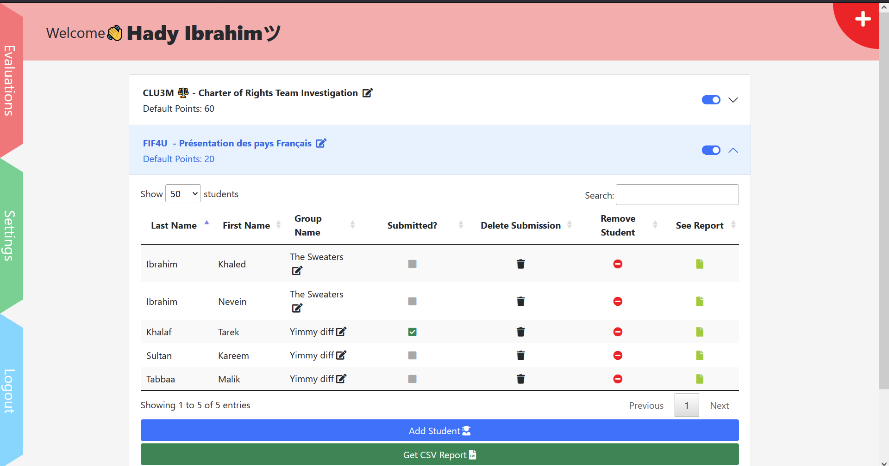
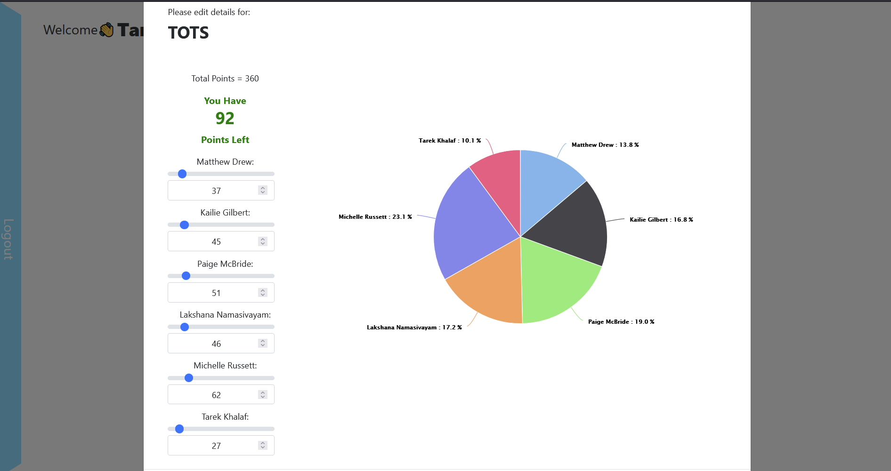

<h1>West Carleton Secondary School Peer Evaluator</h1><center

  

<b>Developed by:</b> Hady Ibrahim and Shushawn Saha

<b>Languages Used:</b>PHP, mySQL, Javascript, HTML/CSS

<b>Technologies Used:</b>jQuery, Datatables, Highcharts, JSON

<b>Purpose:</b>A full-stack web-application where teachers create and manage projects, and students can easily evaluate their peers. Admins are able to 

  
  <h1>View 1: Teacher</h1>
  

  
  <h1>View 2: Student</h1>
  
  

